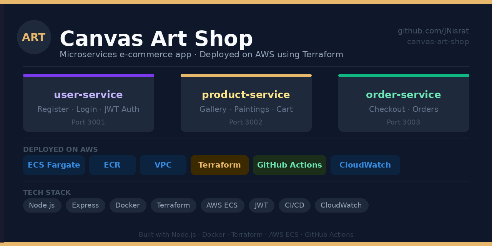

# 🎨 Canvas Art Shop

A microservices e-commerce app for selling original canvas paintings — built to showcase real-world DevOps skills.



---

## Services

| Service | What it does | Port |
|---------|-------------|------|
| user-service | Register, login, JWT auth | 3001 |
| product-service | Painting gallery UI | 3002 |
| order-service | Checkout & orders | 3003 |

---

## Tech Stack

`Node.js` `Express` `Docker` `Terraform` `AWS ECS Fargate` `AWS ECR` `GitHub Actions` `JWT` `CloudWatch`

---

## Run Locally

```bash
git clone https://github.com/JNisrat/canvas-art-shop.git
cd canvas-art-shop
docker-compose up --build
```

| URL | What you see |
|-----|-------------|
| http://localhost:3002 | Painting Gallery |
| http://localhost:3003 | Checkout |
| http://localhost:3001 | User API |

---

## Deploy to AWS

```bash
cd infrastructure
terraform init
terraform apply -var="account_id=YOUR_ACCOUNT_ID"
```

Destroy when done to avoid charges:
```bash
terraform destroy -var="account_id=YOUR_ACCOUNT_ID"
```

---

## CI/CD Pipeline

Every push to `main` automatically builds Docker images, pushes to ECR and deploys to ECS Fargate.

---

## Project Status

| Week | Task | Status |
|------|------|--------|
| Week 1 | Build 3 microservices | ✅ Done |
| Week 2 | Dockerise all services | ✅ Done |
| Week 3 | Deploy to AWS with Terraform | ✅ Done |
| Week 4 | CI/CD with GitHub Actions | ✅ Done |
| Week 5 | Monitoring with CloudWatch | 🔄 In Progress |

---

## Author

**Nisrat Jahan** · Brisbane, QLD
[LinkedIn](https://www.linkedin.com/in/nisrat-jahan2306161b0/) · jahannisrat26@gmail.com
